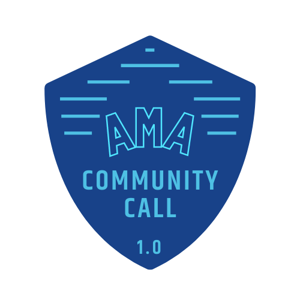
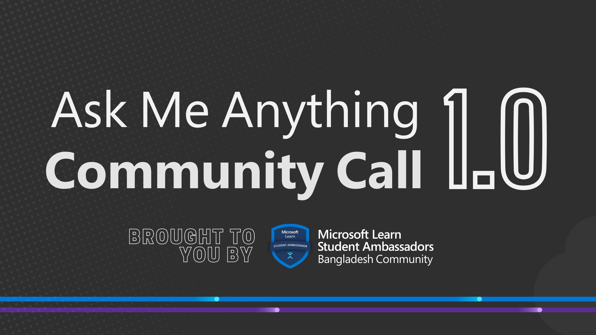

# AMA-Community-Call-1.0 

 

  

 
 

## :scroll: Event Snippet

With the progress of time, Microsoft Learn Student Ambassadors from Bangladesh are reaching toward more potential individuals across the country through our technical and insightful activities.Even so, it is still a dream for a large number of students to become an ambassador backed by Microsoft, lead tech communities and inspire their peers.We want them to prove their worth to be in such role of leadership and technical excellence. That is why we have taken an initiative to get their back and take the ultimate leap to join our force!

**This community call had 4 sessions which are :** 
- Introduction to Microsoft Learn Student Ambassadors Bangladesh Community
- Overview and How to Apply to the **Microsoft Learn Student Ambassadors** Program.
- Debunkiung the Myths of the **Microsoft Learn Student Ambassadors** Program.
- Question and Answer Session

  

## :books: Event Handbook 
### Grab the **Exclusive Handbook** on **Debunking Ambassador Myths**!

### The handbook covers- 
* Common myths which tend to restrain a student to apply for the program  
* Public beliefs and the actual facts 
 
## :movie_camera: Event Recording

[Event Recording](https://youtu.be/02GRRQv-y5M) is now Available on **YouTube**

## :star: Credits
- [Anjum Rashid](https://github.com/bijoy26) (Ambassador)  
- [Mohammad Iftekher Ebne Jalal](https://github.com/iftu119) (Ambassador)  
- [Jonayed Tanjim](https://github.com/tanjim01) (Ambassador)  

----
